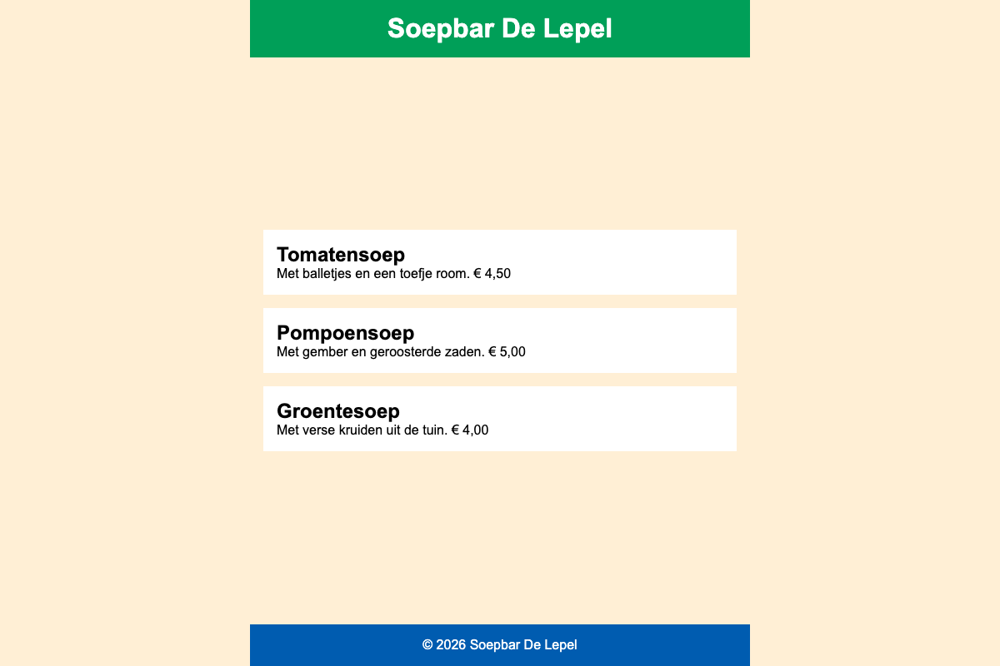

# kolom

Een eerste kennismaking met `flex-direction: column`. Bij een kolom draaien de assen om: de hoofdas loopt van boven naar onder, de dwarsas van links naar rechts. `justify-content` werkt dus verticaal en `align-items` horizontaal.

Maak de preview hieronder na.

* een `header` met een `h1` "Soepbar De Lepel"
* een `main` met daarin drie `article` elementen, elk met een `h2` (de soep) en een `p` (de beschrijving en de prijs)
* een `footer` met een `p` waarin je &copy; als HTML-entiteit schrijft
* maak van de body een flex-container met `flex-direction: column` en een hoogte van minstens `100vh`
* header, main en footer zijn maximaal `600px` breed en staan gecentreerd. Centreer ze met flexbox, niet met marges.
* geef `main` een `flex-grow` van `1`, zo blijft de footer onderaan het scherm staan ook al is er weinig inhoud
* maak ook van `main` een flex-container met `flex-direction: column`, met `1rem` ruimte tussen de artikels
* centreer de artikels verticaal binnen de main
* kleuren: achtergrond `papayawhip`, header `#009F58`, footer `#005CB0`, artikels `white`, tekst in header en footer `white`

> **TIP**: maak het browservenster eens hoger en lager. De footer hoort altijd onderaan te blijven.

## Verwacht resultaat

