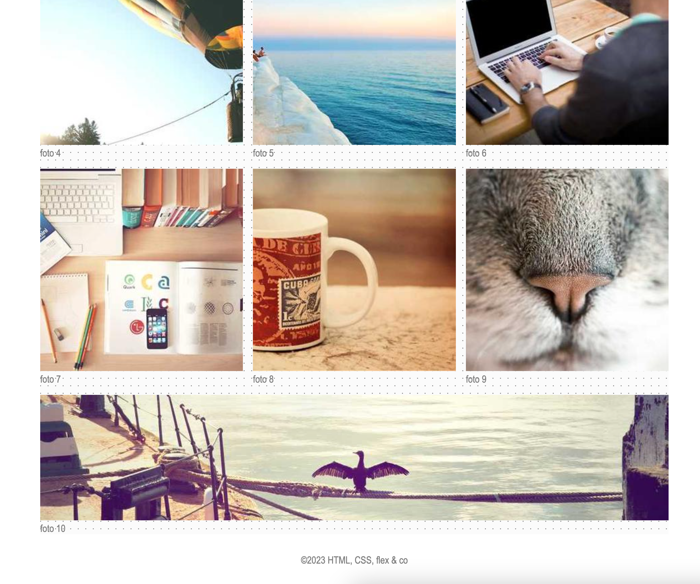

# portfolio-grow

* Kopieer je oplossing van `portfolio`
* Zorg er nu voor dat de laatste image de volledige breedte van de main inneemt (gebruik `flex-grow`)
* Zorg dat de laatste image breed genoeg is (1000px) maar niet te hoog (bv. 200px)

## Verwacht resultaat

