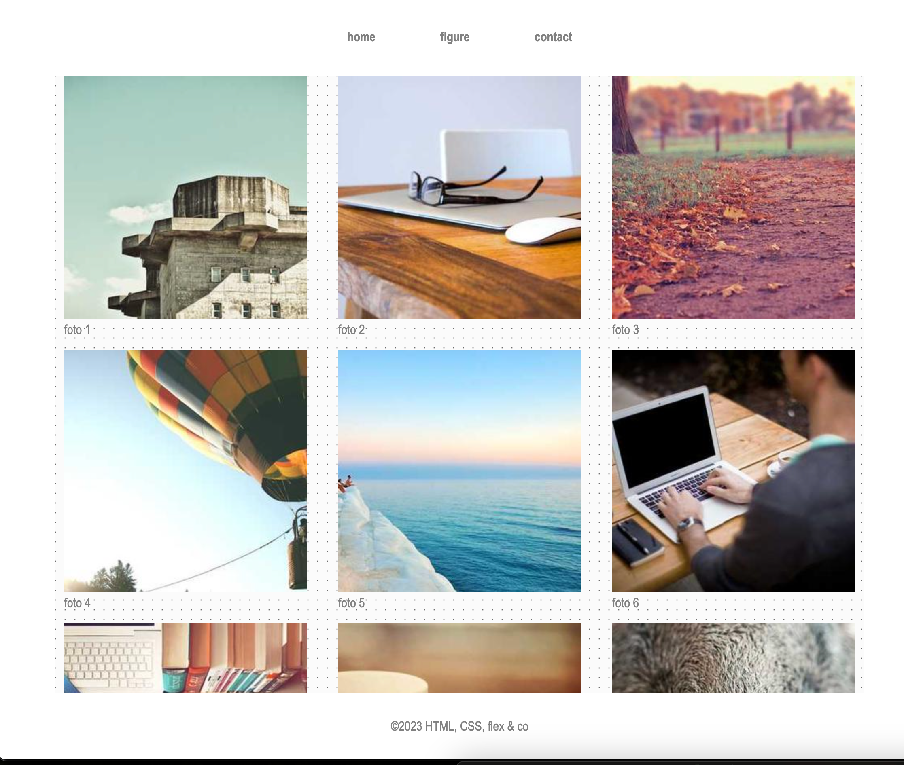

# portfolio

Maak de preview van het flex-box model na.

* de inhoud is maximaal 1000px breed en staat gecentreerd. Maak van de body zelf een flex-container en centreer de kinderen met flexbox.
* het lettertype over de gehele pagina is `Franklin Gothic Medium`,...&#x20; 
* voorzie een `main` met daarin 10 figures met met daarin telkens een afbeelding
* gebruik [Picsum.photos](https://picsum.photos) voor de foto's. Zorg voor foto's van 300x300px.
* geef de img een breedte van 100% van het figure element. 
* voorzie elke figure van een figcaption (foto 1, foto 2, foto 3, ...)
* zet nav en main in een flexbox.
* zorg dat elk flex-item een `flex-basis` van `300px` heeft en niet groeit, zodat de foto's naar een volgende lijn wrappen zodra ze niet meer passen.
* zorg dat er `1rem` ruimte tussen elk flex-item zit
* zet © om naar een HTML-entiteit in de footer 
* de footer heeft een witte achtergrond en een padding van `2rem`
* de main heeft een herhalende achtergrond afbeelding (staat bij deze opgave)

## Verwacht resultaat

